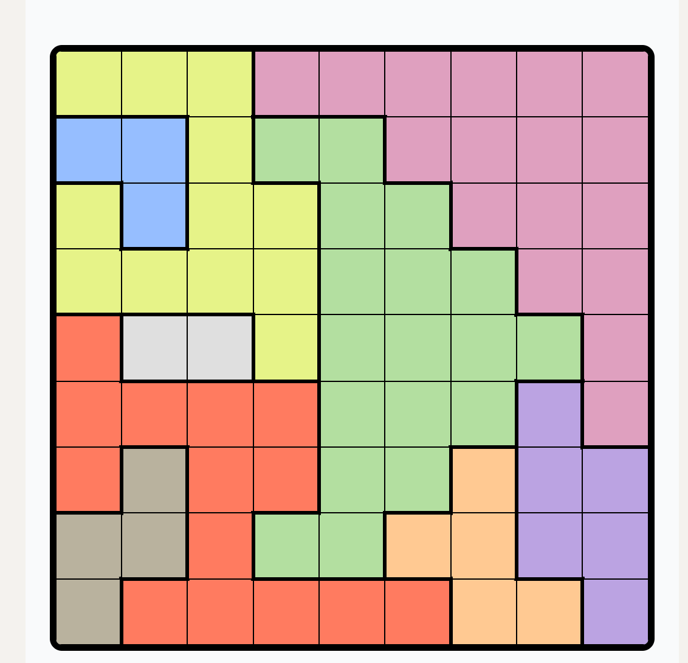
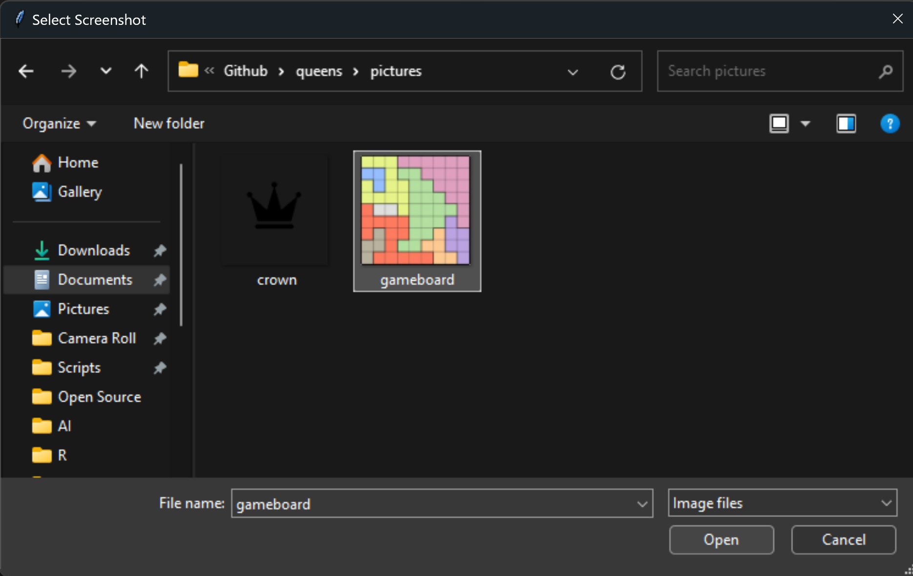
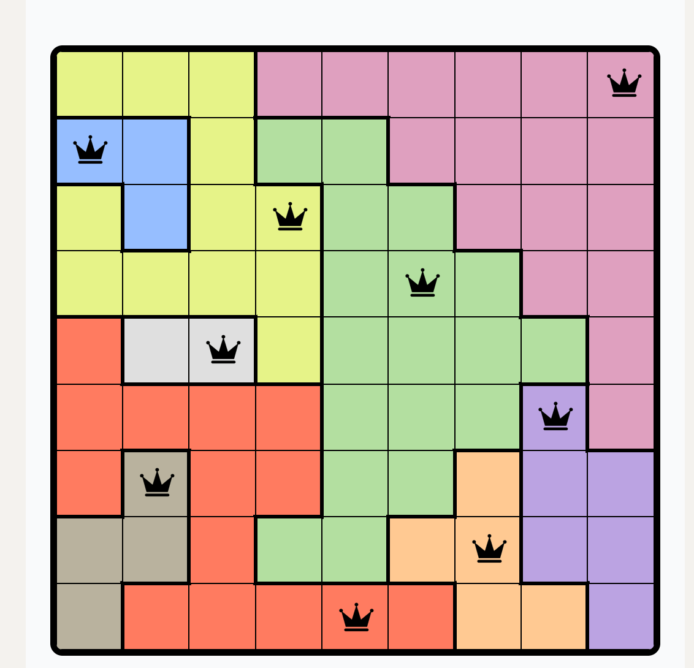

[![LinkedIn][linkedin-badge]][linkedin-url]

<div align="center">
  <a href="https://www.linkedin.com/games/queens/" />
    
  </a>
</div>

<h1>
<p align= "center">
    <br>Queens Solver
</h1>


## About

A solver for LinkedIn's Queens game. [Queens] is one of LinkedIn's four daily puzzle games. The game involves arranging queens on a 9-by-9 grid with the following conditions:

- Exactly one queen must be placed in every row
- Exactly one queen must be placed in every column
- Exactly one queen must be placed in every colored region
- A queen cannot be placed next to another queen

The program prompts you to provide a screenshot of the initial Queens gameboard. Then, it loads the image and detects the lines on the board, allowing it to determine the position of each square in the grid. After extracting the square colors, the program uses backtracking to identify the correct queen placements, which are outputted in the terminal and on a new PNG image.

#### I have never and do not intend to use this to cheat at Queens -- that would defeat the fun of playing.

## Prerequisites

#### Install required modules with pip:

> [tkinter]
| Note: tkinter is included in The Python Standard Library

```sh
pip install tk
```

> [pillow]

```sh
pip install pillow
```

> [numpy]

```sh
pip install numpy
```

> [cv2]

```sh
pip install opencv-python
```

## Usage

### Take a screenshot of the gameboard.


### Run queens.py and select the screenshot.


### Access the newly-created solution.png file.


## Contact

Kyle Gilbert - gilbert.ke@hotmail.com


<!-- Link Definitions -->
[linkedin-badge]: https://img.shields.io/badge/LinkedIn-0077B5?style=for-the-badge&logo=linkedin&logoColor=white
[linkedin-url]: https://www.linkedin.com/in/kylegilbertpsu/
[pillow]: https://pypi.org/project/pillow/
[numpy]: https://numpy.org/install/
[cv2]: https://pypi.org/project/opencv-python/
[tkinter]: https://docs.python.org/3/library/tkinter.html
[Queens]: https://www.linkedin.com/games/queens/